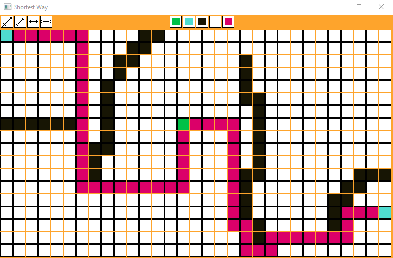

# Shortest-Way-SDL2
Illustrates Breadth First Search

Hotkeys:
"a": decrease interval between sqaures\n
"d": increase interval between sqaures;
"w": increase size of sqaures;
"s": decrease size of sqaures;
"space": find path;

Buttons(from left to right):
1: same as "w";
2: same as "s";
3: same as "d";
4: same as "a";
green, aqua, black: assign the color of your pencil(if you click twice will assign to white color);
white: clear all squares;
pink: same as "space";
